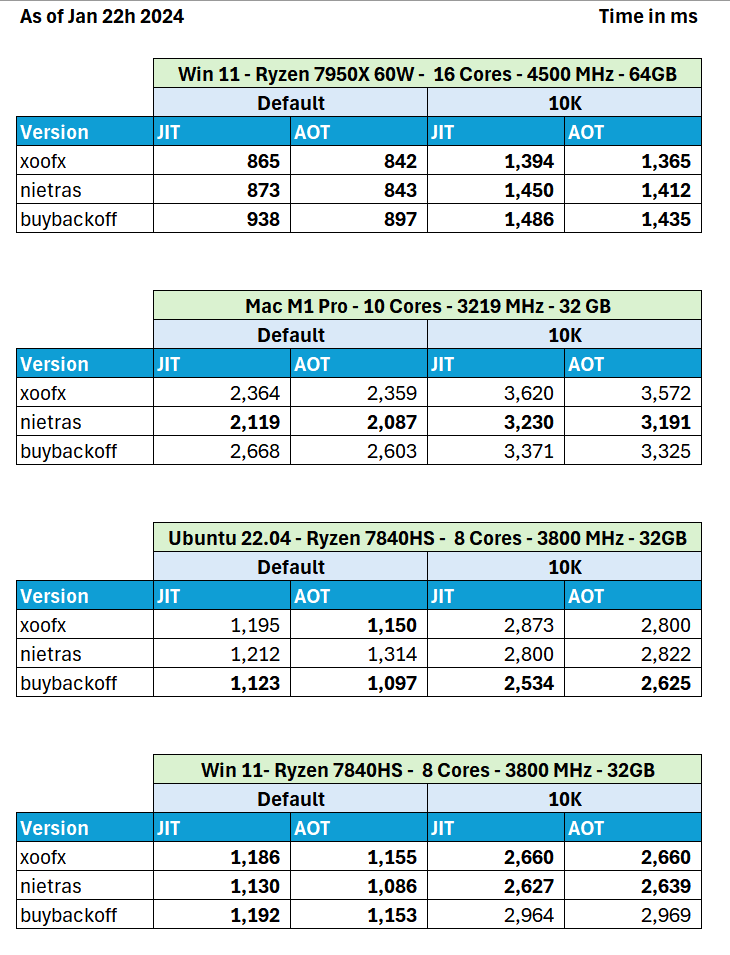

# 1️⃣🐝🏎️ The One Billion Row Challenge - .NET Edition

> The One Billion Row Challenge (1BRC [Original Java Challenge](https://github.com/gunnarmorling/1brc)) is a fun exploration of how far modern .NET can be pushed for aggregating one billion rows from a text file.
> Grab all your (virtual) threads, reach out to SIMD, optimize your GC, or pull any other trick, and create the fastest implementation for solving this task!

Aggregated results for C#/F# at https://github.com/praeclarum/1brc

**Fast1BRC** is one of the fastest 😅 implementation in the .NET wild west. 🚀

## Techniques used

- Multiple threads and some SIMD
  - SIMD used [here](https://github.com/xoofx/Fast1BRC/blob/28589e047c4106357995d4bdb37b70d16f5184d7/Program.cs#L356-L388) mostly for finding the index of `;` separating the city name with the temperature
  - We can then keep the full city name in a single `Vector256<byte>` register (when the city name is `<=` 32)
  - For the threads, I'm keeping the main thread busy processing the last block
- On Windows, no memory mapped file but RandomAccess reopening the same handle per thread
  - As I discovered that it is lowering OS contention on Windows
  - On Linux, it seems that it's less an issue, performance being relatively the same
  - On Mac, memory mapped file seem to perform much better
- Initially, I implemented the dictionary to store the correspondance between city names and counters with a FNV-1A 64 bit hashing aligned on 8 bytes boundary, but I was told that this is not accepted as discussed [here](https://github.com/gunnarmorling/1brc/pull/186#issuecomment-1880132600), so I change the implementation to 2 dictionaries:
  - One with a key of 32 bytes - implemented with `Vector256<byte>` that covers the default dataset (names below 32 chars)
  - One with a key of 128 bytes to support the limit of city names (100 characters)
  - Both are implemented with `Vector256<byte>`
  - Cache entries are aligned on 64 bytes to allow better cache usage
  - [Dictionary implementation](https://github.com/xoofx/Fast1BRC/blob/28589e047c4106357995d4bdb37b70d16f5184d7/Program.cs#L889-L932) is taken from .NET BCL but reimplemented with unsafe and with using pointers directly instead of indices
  - For the 32 bytes key, the implementation inline things directly so that we maximize the codegen with everything being kept in registers.
  - For the hash of the dictionary (both 32 bytes and 128 bytes key), I'm hashing the first 16 bytes by XORing the 2 first `ulong` with an intermediate multiplication by 397 for the first `ulong` (prime number that gives good results). It is enough simple and efficient to not have any collisions.
- No particular tricks for parsing the temperature, apart assuming that there is only 1 digit after the `.`.
  - When I changed the code to not parse the temperature, it was not changing meaningfully the results.

## Results

Benchmark performed on 3 different machines with a different combination of OS, with the following top libraries:

- Fast1BRC (This repository)
- [Nietras's 1brc](https://github.com/nietras/1brc.cs)
- [Buybackoff's 1brc](https://github.com/buybackoff/1brc)




Some comments:

- Results are varying a lot! 📊
- My solution comes really really close 🥈 to Nietras solution (5% on average), but his solution is probably slightly more consistent and overall winning! 🥇
  - I discovered that it can be easy to mess things with a slight change that could work on one machine/platform but not work on another. Process/Threading priority tweaking are super sensitive and I stopped tweaking them in the end and I'm using the default. 😅
- The results vary vastly between HW / OS 💾
  - The first aspect is the performance of the M2/SSD disk access
  - The second aspect is CPU performance (number of cores, caches, clock...etc.)
  - When looking at a profiler, on my Windows machine, the time passed in IO is almost equal to CPU.
  - Some machines could give very different results (e.g buybackoff own results on his repo)
  
## Build

You need to have [.NET 8 SDK installed](https://dotnet.microsoft.com/en-us/download/dotnet/8.0)

```
dotnet publish -c Release -r win-x64
.\bin\Release\net8.0\win-x64\publish\Fast1BRC measurements.txt
```

To fully test, you need to generate `measurements.txt`, easier on Ubuntu/MacOS:

- Install OpenJDK 21 https://jdk.java.net/21/
- Install Maven 3.9+ https://maven.apache.org/download.cgi
- Clone `https://github.com/gunnarmorling/1brc` and go to its folder
- Run `mvn package` 
- Run `./create_measurements.sh 1000000000`
- Copy `measurements.txt` to a place where you can use it with Fast1BRC

## License

This software is released under the [BSD-2-Clause license](https://opensource.org/licenses/BSD-2-Clause). 

## Author

Alexandre Mutel aka [xoofx](https://xoofx.github.io).
